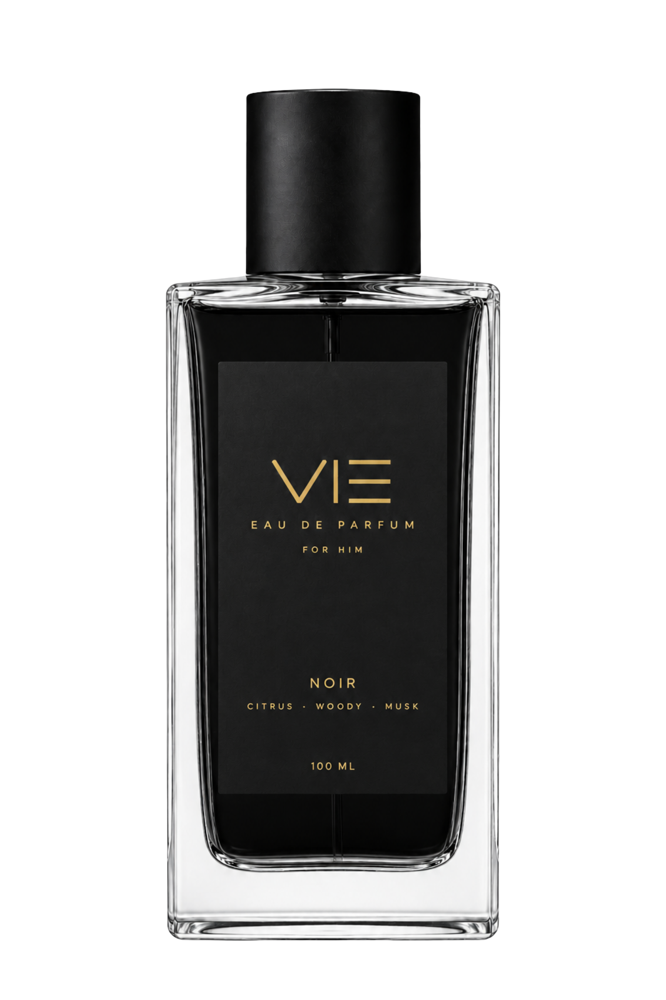

# VIE | Haute Parfumerie Interactive 3D Parallax Showcase

An ultra-luxurious, immersive 3D parallax hero web application designed for **VIE Haute Parfumerie**. Built with React, Vite, Tailwind CSS v4, and GSAP.



## ✨ Features

- **5-Layer Depth Architecture**:
  - **Layer 1 (z-10)**: Fullscreen ambient morphing background with dynamic radial vignettes tailored to each fragrance mood.
  - **Layer 2 (z-20)**: 21vw watermark typography (`NOIR`, `URBAN`, `WATER`, `CEDAR`) with synchronized directional slide animations.
  - **Layer 3 (z-30)**: Ambient gold & emerald floating particles with foreground mouse parallax tracking.
  - **Layer 4 (z-40)**: Centered hero perfume bottle with 3D cursor tilt, reverse parallax, photorealistic studio contact shadow, and smooth vertical drop & elastic rise transitions (`back.out(1.2)`).
  - **Layer 5 (z-50)**: Minimalist luxury navigation, edition badge, olfactory note tags, pricing, and bottom controls with adaptive dark/light contrast.
- **Sequential Drop & Rise Transitions**: Seamlessly animates the previous bottle dropping out of view before introducing the incoming bottle with an elastic bounce.
- **Transition Lock**: Debounced navigation controls prevent mid-flight animation stutter and maintain smooth 60fps performance.
- **Custom Authentic Assets**: Fully integrated with high-resolution transparent bottle assets for NOIR, URBAN, WATER, and CEDAR.

## 🛠️ Tech Stack

- **Framework**: React 19 + Vite
- **Styling**: Tailwind CSS v4
- **Animations**: GSAP (GreenSock Animation Platform)
- **Icons**: Lucide React
- **Typography**: Google Fonts (*Cinzel*, *Cormorant Garamond*, *Plus Jakarta Sans*)

## 🚀 Getting Started

### 1. Clone the repository
```bash
git clone https://github.com/IzulVie/Web_Parfum.git
cd Web_Parfum
```

### 2. Install dependencies
```bash
npm install
```

### 3. Run development server
```bash
npm run dev
```

Visit `http://localhost:5173` in your browser.

### 4. Build for production
```bash
npm run build
```

---

© 2026 VIE Parfumerie. All rights reserved.
